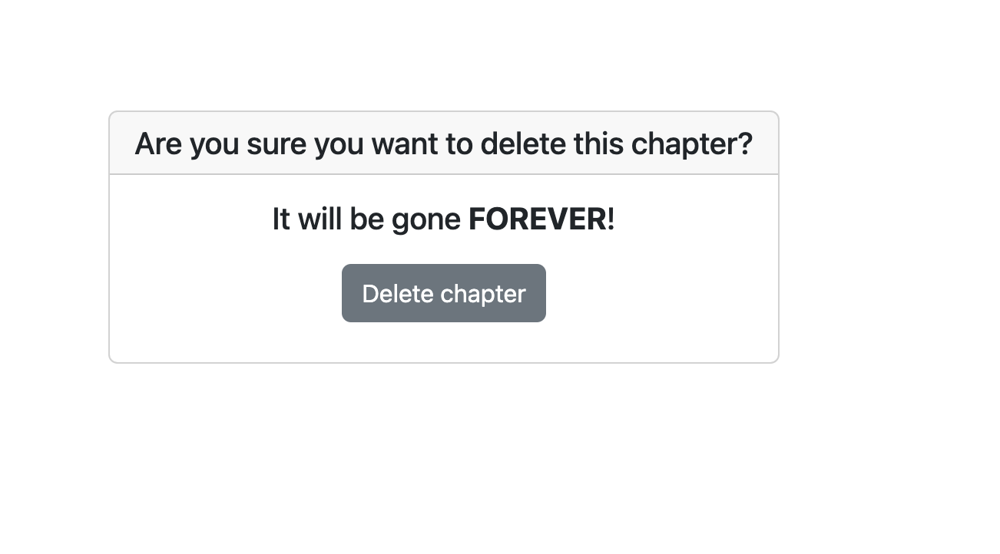

# Inkpad
Inkpad is a book that allows users to become their own author. It helps people who want to publish a book, put their writing to action and share their talent with the world. But it's not just for the future authors, it's also for those who love to read. This website allowsusers to dive deeper into their passion to write, or just their passion to read.


The live link for "Inkpad" can be found [HERE](https://p4-inkpad-f8f405fd38c0.herokuapp.com/)

## Table of Contents
+ [UX](#ux "UX")
  + [Site Purpose](#site-purpose "Site Purpose")
  + [Site Goal](#site-goal "Site Goal")
  + [Audience](#audience "Audience")
  + [Communication](#communication "Communication")
  + [Current User Goals](#current-user-goals "Current User Goals")
  + [New User Goals](#new-user-goals "New User Goals")
+ [User Stories](#user-stories "User Stories")
  + [Admin stories](#admin-stories "Admin stories")
  + [Artist stories](#artist-stories "Artist stories")
  + [Visitor stories](#visitor-stories "Visitor stories")
+ [Design](#design "Design")
  + [Colour Scheme](#colour-scheme "Colour Scheme")
  + [Typography](#typography "Typography")
  + [Imagery](#imagery "Imagery")
+ [Features](#features "Features")
  + [Existing Features](#existing-features "Existing Features")
  + [C.R.U.D](#crud "C.R.U.D")
+ [Testing](#testing "Testing")
  + [Validator Testing](#validator-testing "Validator Testing")
  + [Unfixed Bugs](#unfixed-bugs "Unfixed Bugs")
+ [Technologies Used](#technologies-used "Technologies Used")
  + [Main Languages Used](#main-languages-used "Main Languages Used")
  + [Frameworks, Libraries & Programs Used](#frameworks-libraries-programs-used "Frameworks, Libraries & Programs Used")
+ [Deployment](#deployment "Deployment")
+ [Credits](#credits "Credits")
  + [Content](#content "Content")
  + [Media](#media "Media")

## UX

### Site Purpose:

There is two purposes for this website, the first is for helping people publish their book. This gives them the chance to post books they are curently writing, especially if they aren't confident in their work or writing. The second purpose is for those who love to read but are not always able to pay Amazon prices for books, and don't mind unedited books. The user also doesn't get the worlds input on a book, they just go into it with only a synopsis and their imagination. In this generation of BookTok where people are always commenting what book is good and not, this website prevents this. The 

### Site Goal:
The goal is to help authors publish their book, without having to worry about who likes it. The site purposely doesn't show you who's liked it or who bookmarked it, because the goal is to develop your writing skills and confidence in yourself. 

### Audience:
This website is for those who love to read or those who love to write, or both! Whether users are a seasoned reader, or just getting back into reading, this website is perfect. This website is for the confident authors, to the not so confident, for the published and the unpublished. There is no specific age for this website, as there is no age limit on pursuing something you like.

### Communication:
The layout is a simple making for a easy and straightforward usage.

### Current User Goals:
For the authors to be able to publish their book to the world. For the reader, they get to read something unique and free!

### New User Goals:
To become instantly engaged with the design of the site, and feel intrigued to explore all it has to offer.

### Future Goals:
- To create a profile biography for users, where they write about themself and add a image.
- To be able to see the author username, taking you to their profile to see their other work.
- Users will be able to search for books by name
- Users will be able to filter browse by genre
- Implement a feature that for a fee we help them get published on Amazon or print.
- Users can have a discussion thats only available after reading the book.

## User Stories
Not all stories have been implemented. Some have been left for future implementations as the site grows and expands.

### Admin stories:
#### As an admin:
1. I can **submit new chapter** so that **I can inform site visitors & artists of new events, artists, and more**.
2. I can **moderate blog comments** so that **the feedback provided is appropriate**.
3. I can **create a log in / sign up page** so that **artists and visitors can sign up to the site**.

### Book stories:
#### As an User:
1. I can **create a user profile** so that **I can create books, for publish and draft**.
2. I can **create a book** so that **I can publish it or put in drafts**.
3. I can **create a chapter** so that **I can publish it to my book or put in drafts**.
4. I can **bookmark a book** so that **I can hsave books I like**.
5. I can **read a book** so that **I can enjoy a book**.
6. I can **edit or delete a book** so that **I can change my work to suit me**.
7. I can **edit or delete a chapter** so that **I can update of details of my chapter**.


 ## Design

### Database Schema


### Colour Scheme:

The colour palette used: 
- Navbar & footer : #f1e7c1ea
- Buttons : #484747
- Along with various shades of gre

### Typography:
All fonts were obtained from the Google Fonts library. I chose to stick with one font, Monsteratt.

### Imagery:
- All images were taken from pexel.

## Features

### Existing Features:

#### Home Page:


#### Navigation Bar:

##### Desktop:


##### Mobile:


#### Book Details page:


#### Add a Chapter Page:


#### Delete Chapter Page:



#### Delete Book Page:


#### Browse Books Page:


#### Completed Book Page:


#### Read Book Page:


#### Profile Page:


#### Browse Books Page:


#### Bookmarked Books Page:


#### Draft Books Page:


#### View Chapter Page:


#### Edit Chapter Page:


#### Edit Book Page:


#### Browse Books Page:


#### Log in, Log out & Sign up:

##### Login:


##### Logout:


##### Sign-up:


#### Social Links:


### Who gives a C.R.U.D:

#### Create (form):
- The users can create their book details on the page.
- It is only visible to users who are signed in to see the button or page.


#### Create (form):
- The users can write their chapters on this page.
- It is only visible to users who are signed in and the author of the book.
- It can only be accessed when a book is created pubklished or draft.


#### Read:


#### Update & Delete:
- Authors can edit book chapters and book details.
- Authors can change status of book from published to draft and vice versa.


### Features Left to Implement
- Community section
- Author profiles
- Contact page
- Password reset
- Social media sign-in
- Preview book and chapter
- Search by name or genre 

## Testing

### Validator Testing
| **TEST** | **ACTION** | **EXPECTATION** | **RESULT** |
| ----------------------------- | ----------------------- | --------------------------- | ---------- |
| printstatements - settings.py | PEP8 validator | [No issues found] | ✅ |
| printstatements - urls.py | PEP8 validator | No issues found | ✅ |
| book app - forms.py | PEP8 validator | No issues found | ✅ |
| book app - models.py | PEP8 validator | No issues found | ✅ |
| book app - views.py | PEP8 validator | No issues found | ✅ |
| book app - urls.py | PEP8 validator | No issues found | ✅ |
| book app - admin.py | PEP8 validator | No issues found | ✅ |
| browse app - forms.py | PEP8 validator | No issues found | ✅ |
| browse app - models.py | PEP8 validator | No issues found | ✅ |
| browse app - views.py | PEP8 validator | No issues found | ✅ |
| browse app - urls.py | PEP8 validator | No issues found | ✅ |
| browse app - admin.py | PEP8 validator | No issues found | ✅ |
| style.css | [W3C - Jigsaw](https://jigsaw.w3.org/css-validator/) validator | [No issues found](static/images-readme/w3c-css.png) | ✅ |
| Home page - html | [W3C](https://validator.w3.org/) validator - source code | No issues found | ✅ |
| About page - html | W3C validator - source code | No issues found | ✅ |
| Blog page - html | W3C validator - source code | No issues found | ✅ |
| Prints page - html | W3C validator - source code | No issues found | ✅ |
| Sign-in page - html | W3C validator - source code | No issues found | ✅ |
| Home page - html | lighthouse | [Acceptable scores]| ✅ |
| script.js- js | JS Lint | No issues found | ✅ |
| Chrome browser | Launch site | Site opens without issue | ✅ |
| Safari browser | Launch site | Site opens without issue | ✅ |

### Responsiveness testing

| **TEST**                      | **ACTION**              | **EXPECTATION**             | **RESULT** |
| ----------------------------- | ----------------------- | --------------------------- | ---------- |
| Home page - responsiveness    | Size site down to 320px | all elements stay on screen | ✅         |
| Home page - responsiveness    | Size site up to 1300px  | all elements stay on screen | ✅         |
| Edit pages - responsiveness   | Size site down to 320px | all elements stay on screen | ✅         |
| Edit pages - responsiveness   | Size site up to 1300px  | all elements stay on screen | ✅         |
| Delete pages - responsiveness  | Size site down to 320px | all elements stay on screen | ✅         |
| Delete pages - responsiveness  | Size site up to 1300px  | all elements stay on screen | ✅         |
| Read book page - responsiveness    | Size site down to 320px | all elements stay on screen | ✅         |
| Read book page - responsiveness    | Size site up to 1300px  | all elements stay on screen | ✅         |
| Sign-in page - responsiveness | Size site down to 320px | all elements stay on screen | ✅         |
| Sign-in page - responsiveness | Size site up to 1300px  | all elements stay on screen | ✅         |
| Sign-up page - responsiveness | Size site down to 320px | all elements stay on screen | ✅         |
| Sign-up page - responsiveness | Size site up to 1300px  | all elements stay on screen | ✅         |
| Log-in page - responsiveness | Size site down to 320px | all elements stay on screen | ✅         |
| Log-in page - responsiveness | Size site up to 1300px  | all elements stay on screen | ✅         |
| Create pages - responsiveness | Size site down to 320px | all elements stay on screen | ✅         |
| Create pages - responsiveness | Size site up to 1300px  | all elements stay on screen | ✅         |
| View chapters page - responsiveness | Size site down to 320px | all elements stay on screen | ✅         |
| View chapters page - responsiveness | Size site up to 130px  | all elements stay on screen | ✅         |
| Draft page - responsiveness | Size site down to 320px | all elements stay on screen | ✅         |
| Draft page - responsiveness | Size site up to 1300px  | all elements stay on screen | ✅         |
| Bookmark page - responsiveness | Size site down to 320px | all elements stay on screen | ✅         |
| Bookmark page - responsiveness | Size site up to 1300px  | all elements stay on screen | ✅         |
| Browse page - responsiveness | Size site down to 320px | all elements stay on screen | ✅         |
| Browse page - responsiveness | Size site up to 1300ox  | all elements stay on screen | ✅         |
| Book view page - responsiveness | Size site down to 320px | all elements stay on screen | ✅         |
| Book view page - responsiveness | Size site up to 1300ox  | all elements stay on screen | ✅         |

### C.R.U.D. testing

| **TEST**          | **ACTION**             | **EXPECTATION**          | **RESULT** |
| ----------------- | ---------------------- | ------------------------ | ---------- |
| Book - Create     | Add new instance to DB | Instance created         | ✅         |
| Book - Read       | Retrieve all instances | Instances visible in UI  | ✅         |
| Book - Update     | Modify an instance     | Mods saved & visible     | ✅         |
| Book - Delete     | Delete an instance     | Instance removed from UI | ✅         |
| Chapter - Create | Add new instance to DB | Instance created         | ✅         |
| Chapter - Read   | Retrieve all instances | Instances visible in UI  | ✅         |
| Chapter - Update | Modify an instance     | Mods saved & visible     | ✅         |
| Chapter - Delete | Delete an instance     | Instance removed from UI | ✅         |
| Bookmark - Create | Add new instance to DB | Instance created         | ✅         |
| Bookmark - Read       | Retrieve all instances | Instances visible in UI  | ✅         |
| Bookmark - Update     | Modify an instance     | Mods saved & visible     | ✅         |
| Bookmark - Delete | Delete an instance     | Instance removed from UI | ✅         |

### FEATURES

| **TEST**                      | **ACTION**             | **EXPECTATION**                                           | **RESULT** |
| ----------------------------- | ---------------------- | --------------------------------------------------------- | ---------- |
| Navigation bar                | Click on nav link      | user routed to correct page                               | ✅         |
| Footer links                  | Click on footer links  | user routed to new browser tab                            | ✅         |
| Bookmark button                   | Click "like"           | book shows as bookmarked and appears in bookmark                           | ✅         |
| Edit button                   | Click edit button      | user navigated to edit screen                             | ✅         |
| Delete button                 | Click delete button    | user is navigated to are you sure and deletes                               | ✅         |
| Internal links                | Click link             | User routed to appropriate page                           | ✅         |
| Login                         | User logs in           | UI updates & user is logged in                            | ✅         |
| Sign up                       | User signs up          | new account created for the user                          | ✅         |
| Logout                        | User clicks logout     | UI updates, user is logged out, user cannot create a book or read a book | ✅         |
| Read book                     | User clicks next Button or Prev button    | Next chapter given                          | ✅         |

### BUG TESTING:

1. Testing CRUD functionality:
- Each of the features were tested multiple times to ensure that numerous new posts could be submitted, and that each post had the ability to be updated and edited by the user that submitted it.
- If a post is submitted by another user, the edit/delete buttons do not appear on the page.

2. CSS styles not loading on app :
The CCS was not loading on the server, I had missed the S of the STACTIC_DIRS in settings.

3. Forms text had html text and fields were next to each other:
I had used {{ form.as_p }}, so i had changed it to {{ form }}, for the edit forms i had made it {{ form | safe }}.
To stop the fields sitting next to each other i had installed crispy forms and used in templates wiht the form.

4. Admin panel not showing duee to TypeError
This was because I had tried to add book.urls to add to another app, they had cauused an error and was removed and the url pattern was re-adjusted to reflect this

5. Jest was not installing:
A manual test had to be completed to test that Javascript had to b created which is listed below.
  Javascript Manual Test -
    Test Case 1: Verify that the 'Next' button in the chapter navigation displays the next chapter.
    Steps to Reproduce:
    - Open the website.
    - Go to browse and choose a book
    - Click read now
    - Press next chapter, previous chapter should appear
    - When on last chapter next button disappears
    Expected Results: Buttons are only, displayed when needed
    Actual Result: As expected buttons only appear when needed
    Pass/Fail: Pass
    Date: 28th January, 2024
    Tester's Name: Danille Hamilton

    Test case 2: Verify that chapters are hidden and only show when buttons are clicked.
    Steps to reproduce:
    - Open the website.
    - Go to browse and choose a book
    - Click read now
    - Only first chapter should. be shown
    Expected Result: The current chapter should be hidden, and the next chapter should be displayed.
    Actual Result: As expected, the next chapter is displayed when the 'Next' button is clicked.
    Pass/Fail: Pass
    Date: 28th January, 2024
    Tester's Name: Danille Hamilton

### Unfixed Bugs
Responsiveness for screen on profile will, not shrink as the nature of how the cards, were formatted. This is only for when users have 3 or more books published or in draft. This has been left like this as I have scored the internet but could not find a resource to help me fix this. 

## Technologies Used
### Main Languages Used
- HTML5
- CSS3
- Javascript
- Python
- Django
- SQL - Postgres

### Frameworks, Libraries & Programs Used
- Google Fonts - for the font family: Monsteratt 
- Font Awesome - to add icons to the social links in the footer element & bookmark
- GitPod - to create my html files & styling sheet before pushing the project to Github.
- GitHub - to store my repository for submission.
- Am I Responsive? - to ensure the project looked good across all devices.
- Favicon - to provide the code & image for the icon in the tab bar.
- Django
- Bootstrap
- DrawSQL

### Installed Packages:
- cloudinary==1.36.0
- crispy-bootstrap5==0.7
- dj-database-url==0.5.0
- dj3-cloudinary-storage==0.0.6
- Django==3.2.23
- django-allauth==0.57.0
- django-bootstrap-v5==1.0.11
- django-crispy-forms==2.0
- django-summernote==0.8.20.0
- gunicorn==20.1.0
- oauthlib==3.2.2
- pillow==10.2.0
- psycopg2==2.9.9
- requests-oauthlib==1.3.1
- sqlparse==0.4.4
- urllib3==1.26.18
- whitenoise==5.3.0

## Deployment
The site was deployed to Heroku. The steps to deploy are as follows:
- Install Django & Gunicorn:
```pip3 install 'django<4' gunicorn```
- Install Django database & psycopg:
```pip3 install dj_database_url psycopg2```
- Install Cloudinary:
```pip3 install dj3-cloudinary-storage```
- Creating the requirements.txt file with the following command:
```pip3 freeze --local > requirements.txt```
- a django project was created using:
```django-admin startproject novelnest .```
- the book app was then created with:
```python3 manage.py startapp book```
- which was then added to the settings.py file within our project directory.
- the changes were then migrated using:
```python3 manage.py migrate```
- navigated to [Heroku](www.heroku.com) & created a new app called print-statements.
- added the Heroku Postgres database to the Resources tab.
- navigated to the Settings Tab, to add the following key/value pairs to the configvars:
1. key: SECRET_KEY | value: randomkey
2. key: PORT | value: 8000
3. key: CLOUDINARY_URL | value: API environment variable
4. key: DATABASE_URL | value: value supplied by Heroku
- added the DATABASE_URL, SECRET_KEY & CLOUDINARY_URL to the env.py file
- added the DATABASE_URL, SECRET_KEY & CLOUDINARY_URL to the settings.py file
- add an import os statement for the env.py file.
- added Heroku to the ALLOWED_HOSTS in settings.py
- created the Procfile
- pushed the project to Github
- connected my github account to Heroku through the Deploy tab
- connected my github project repository, and then clicked on the "Deploy" button


## Credits

### Content
- [Codemy.com](https://www.youtube.com/watch?si=h0MdiwlTrnzxDM3b&v=PXqRPqDjDgc&feature=youtu.be): Youtube video aided in setting up bookmark button and unliking bookmark button.
- [Coding Shiksha](https://www.youtube.com/watch?si=rvKu1ZYg2DASbKhL&v=85-_8j-u4WI&feature=youtu.be): Youtube video aided in setting up Javascript function for buttons clicking to the next page on reading the book..
- “Developing with Django” walkthrough: Provided the initial steps for setting up & deploying the site, as well as this, I also used the instructions they provided in order to implement a django book into my app, following the walkthrough once again step-by-step. This also includes some formatting for the way each log-in, sign-up & log-out is desiigned.
- Tutor Support: For helping mee set up Static when it would not work. Along with helping me understaing a HTTP ERROR code i could not figure out why was coming up, which lead to me having ot use Gitpod. 
- ['Simple is Better Than Complex'](https://simpleisbetterthancomplex.com/tutorial/2018/01/18/how-to-implement-multiple-user-types-with-django.html): creating types of user groups.
- [Bootstrap](https://getbootstrap.com/docs/5.2/components/dropdowns/): dropdown nav menu.
- [Bootstrap](https://getbootstrap.com/docs/5.2/components/card/): dropdown nav menu.
- Django for beginners by William S. Vincent for setting up test for editing book and editing chapter in the book model.
- [Lauren-Nicole](https://github.com/CluelessBiker): For giving me notes on my project and helping me fix html showing up in form when editing. 


### Media
- All photography displayed are from Pexels.

